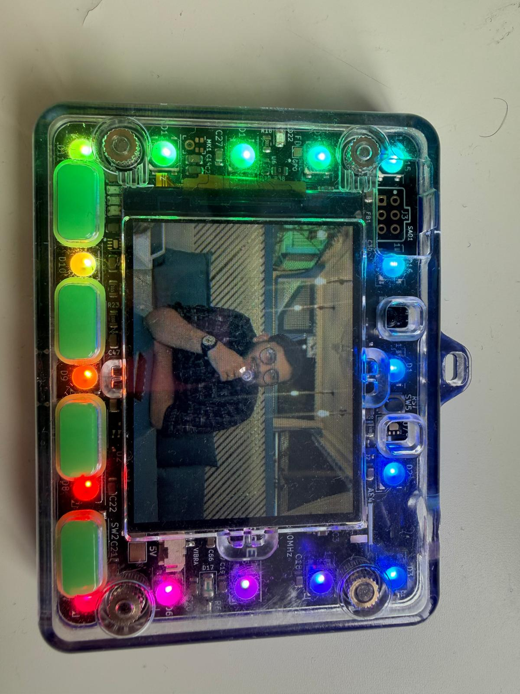
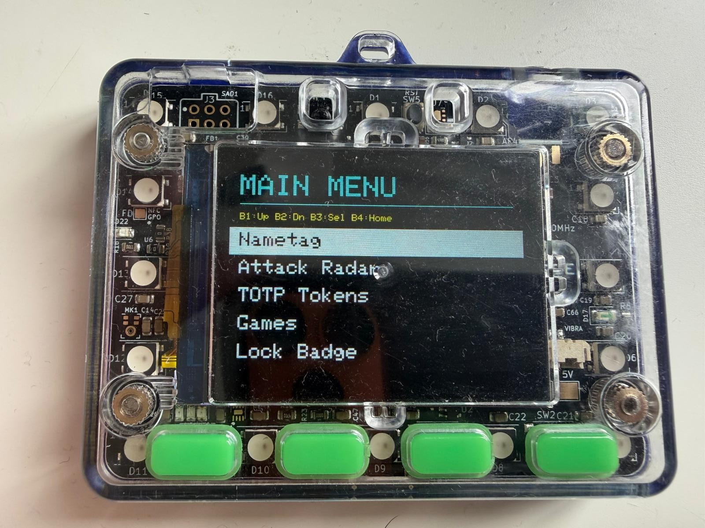
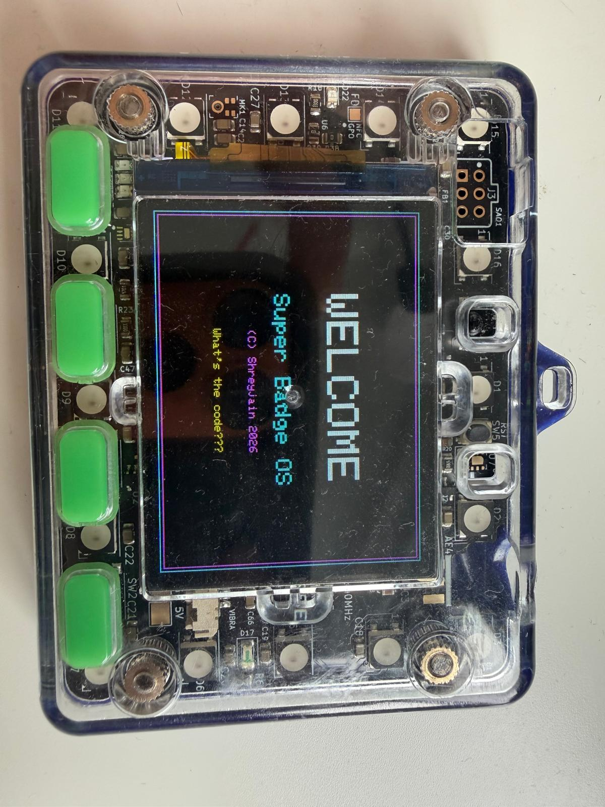
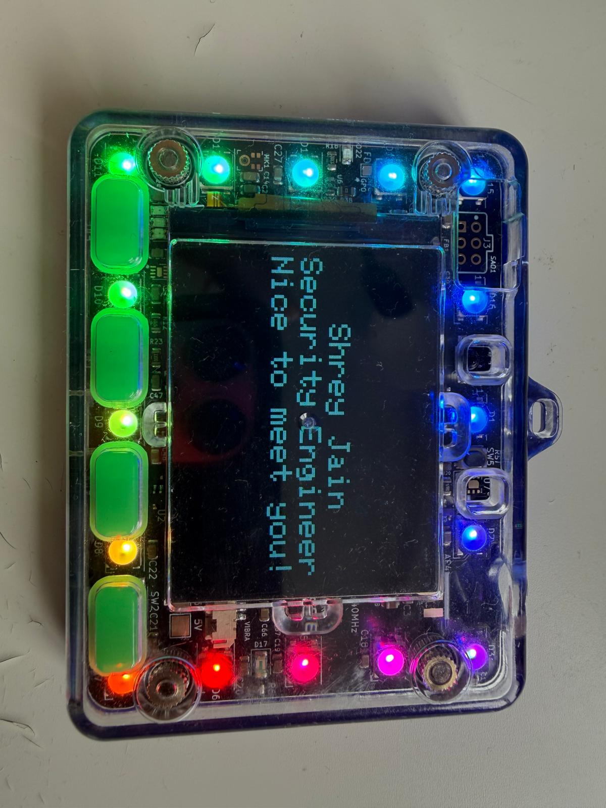
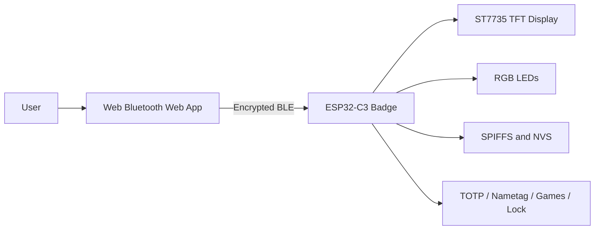

# SuperBadge OS 2.0

SuperBadge OS is a hyper-secure, offline-first operating system designed specifically for the DEFCON 32 badge (powered by an ESP32-C3 microcontroller). It completely overwrites the stock firmware to transform the badge into a cryptographic multi-tool, featuring offline TOTP generation, dynamic Nametags, NeoPixel controls, and classic retro games, all managed by a seamless Web Bluetooth (WebBLE) progressive web app.

## Features

- **Hardware TOTP Authenticator:** Generates time-based one-time passwords (TOTP) entirely offline, with secrets stored in the ESP32's non-volatile storage (NVS).
- **Cryptographic Bluetooth Bonding:** The badge enforces Man-in-the-Middle (MITM) protection via NimBLE. It requires a dynamic 6-digit passkey displayed on the badge's TFT screen to pair with any smartphone, ensuring that the BLE connection is completely immune to eavesdropping.
- **Web Bluetooth Control Panel:** A zero-installation web application hosted on GitHub Pages that interacts directly with the badge over encrypted BLE. It handles real-time time-syncing, TOTP token injection, Nametag customization, and image blasting.
- **Dynamic Image Nametag:** Wirelessly blasts JPEG images over Bluetooth to be rendered on the ST7735 128x128 TFT screen, utilizing custom SPIFFS chunking and dynamic RGB565 byte-swapping.
- **Backwards Compatible Python Client:** Legacy USB serial support for configuring the badge via a wired Mac/Linux/Windows machine.
- **Physical Device Lock:** A customizable PIN lock screen prevents physical tampering of the badge's UI or extraction of TOTP tokens.

## Working Demo

SuperBadge OS 2.0 is running on the DEFCON 32 badge, with the boot screen, main menu, custom display content, RGB LED effects, and nametag features shown in the latest hardware demo.

	
	

	
	

	<video src="Photos/video/badge-working-demo.mp4" controls width="820"></video>

	<a href="Photos/video/badge-working-demo.mp4">Watch the badge working demo</a> |
	<a href="docs/demo.md">Open the complete photo gallery</a>

## Architecture at a Glance

## Repository Structure

- `2.0_Super_Badge/firmware/` - The C++ PlatformIO project containing the complete ESP32-C3 firmware.
- `2.0_Super_Badge/web_app/` - The HTML/JS/CSS source code for the Web Bluetooth progressive web app.
- `2.0_Super_Badge/python_app/` - The legacy Python Tkinter desktop application.
- `docs/` - Comprehensive documentation for installation, architecture, and security design.

## Documentation Trail

To understand how this project was built and how you can replicate it on your own DEFCON badge, please explore the comprehensive documentation:

1. [Installation & Flashing Guide](docs/installation.md) - How to wipe your badge and install SuperBadge OS.
2. [Security Architecture & BLE Bonding](docs/security_model.md) - A deep dive into the cryptography, NimBLE stack, and why the system was built completely offline.
3. [System Architecture Diagrams](docs/architecture.md) - Mermaid diagrams explaining the firmware state machine, WebBLE data flow, and SPIFFS memory management.
4. [Development Challenges](docs/challenges.md) - A log of the engineering hurdles faced during development (e.g. RGB565 color inversion, Web Bluetooth MTU limits, NimBLE passkey quirks).

## Security Perspective & Learnings

This project was engineered from the ground up to explore hardware-level security constraints:
- **Zero-Network Trust:** The ESP32 deliberately has its WiFi stack disabled. All time-syncing and configuration happens over BLE, meaning the device cannot be remotely attacked via the internet.
- **Hardware-Backed Secrets:** TOTP Base32 secrets are saved in the ESP32's NVS layer. The user must possess the physical badge and bypass the physical lock screen to view the 6-digit codes.
- **BLE Passkey Entry:** By weaponizing the ESP32's TFT screen as a `DISPLAY_ONLY` capability, we force the Android/iOS device into a strict Passkey Entry pairing mode, mitigating Just-Works MITM vulnerabilities.

## License
MIT License
