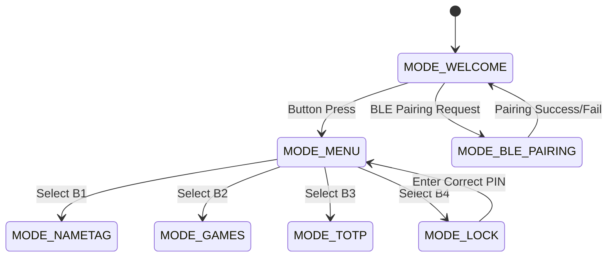
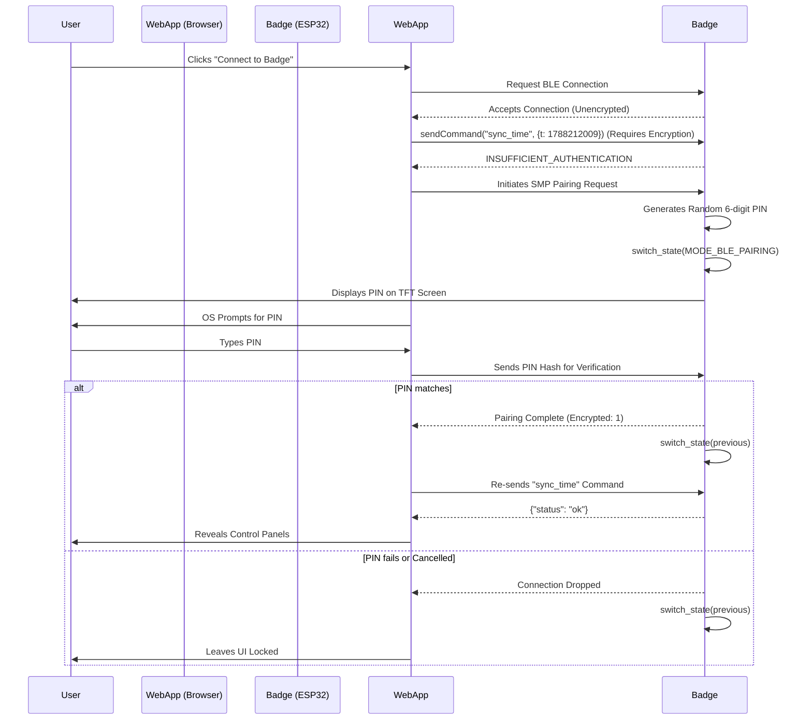
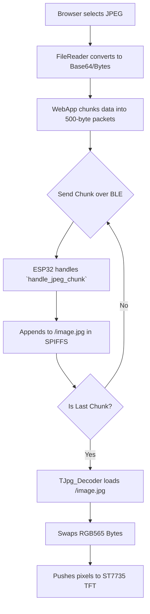

# System Architecture

## Firmware State Machine (ESP32-C3)

The ESP32 runs a single-threaded Arduino-based application that manages the TFT display, physical buttons, and BLE callbacks.

## Web Bluetooth (WebBLE) Data Flow

## Image Blasting via SPIFFS

When an image is uploaded from the Web App, it must be chunked to avoid Bluetooth MTU limits and stored in the ESP32's SPIFFS before it can be decoded to the screen.

