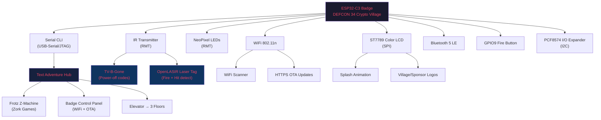

# 🔓 DEF CON 34 — Cryptocurrency Village Badge Analysis

## Device Detection Summary

| Property | Value |
|---|---|
| **Chip** | ESP32-C3 (QFN32), revision v0.4 |
| **Architecture** | RISC-V, Single Core, 160 MHz |
| **Wireless** | Wi-Fi 802.11b/g/n + Bluetooth 5 (LE) |
| **Flash** | 4 MB Embedded (XMC), Manufacturer ID: 0x20 |
| **Crystal** | 40 MHz |
| **USB Mode** | USB-Serial/JTAG (native, no external bridge chip) |
| **MAC Address** | `98:88:E0:50:A3:8C` (Espressif OUI) |
| **Serial Port** | `/dev/cu.usbmodem14101` |
| **Firmware Build** | DEFCON-34, Revision 1.0.3 |
| **Framework** | ESP-IDF v5.5.4 |
| **Badge Label** | `DEFCON SG 1` |

---

## Flash Memory Layout

The badge uses a standard ESP-IDF partition scheme:

| Partition | Type | SubType | Offset | Size |
|---|---|---|---|---|
| `nvs` | data | nvs | `0x00009000` | 20 KB |
| `phy_init` | data | phy | `0x0000E000` | 4 KB |
| `factory` | app | factory | `0x00010000` | 2,048 KB (2 MB) |
| `spiffs` | data | spiffs | `0x00210000` | 1,984 KB (~1.9 MB) |

> [!NOTE]
> The firmware occupies a full 2 MB `factory` partition, and nearly 2 MB of SPIFFS storage holds game data and assets.

---

## 🎮 Capabilities Overview

The badge is a feature-packed hacker toy with **five major modules**:

### 1. 🕹️ Interactive Text Adventure (Frotz Z-Machine Interpreter)

The badge runs **Dumb-Frotz**, a Z-Machine interpreter for classic Infocom text adventure games. The SPIFFS filesystem contains **Zork game data files** (`/spiffs/ZORK%d.DAT`), and the firmware loads these as interactive fiction games playable over the serial CLI.

**How it works:**
- Connect via serial at 115200 baud
- The game boots into a "Nondescript Room" — a wrapper/hub that connects to the badge's other features
- The room contains: a **chair**, a **server**, an **elevator** (with 3 floors), and a **control panel**
- The elevator has **three buttons** (labeled 1, 2, 3) leading to different floors/experiences — likely including Zork gameplay
- Uses standard text adventure commands: `look`, `examine`, `enter elevator`, `press 1`, etc.

**Key strings from firmware:**
```
CryptoHack CLI Ready
You are in a nondescript, window-less room...
You enter the elevator. What button do you want to press? Enter '1', '2' or '3'.
You see two large, open metal elevator doors...
An interpreter for all Infocom and other Z-Machine games.
```

---

### 2. 📺 TV-B-Gone (IR Blaster)

The badge includes a full **TV-B-Gone** module — an infrared transmitter that sends power-off codes for hundreds of TV models from multiple manufacturers. This is a classic DEF CON badge feature.

**Capabilities:**
- Transmits IR power-off codes for TVs from both **NA and EU regions**
- Uses the ESP32-C3's **RMT (Remote Control) peripheral** for precise IR signal timing
- Supports both single-sweep and continuous modes
- 120-second timeout safety cutoff
- Tracks hit statistics persistently in NVS (`cnt_hits`, `cnt_shots`)

**Key firmware references:**
```
./main/modules/tvbgone/tvbgone_badge.c
TV-B-Gone IR hardware configuration done
TV-B-Gone badge module initialized
TV-B-Gone started (both regions, single sweep)
TV-B-Gone finished successfully
```

---

### 3. 🔫 OpenLASIR Laser Tag

The badge has an **IR-based laser tag system** (OpenLASIR protocol) for badge-to-badge combat!

**Capabilities:**
- **Fire button** on GPIO9 — physical button to shoot
- Transmits IR "fire" codes using the RMT peripheral
- Supports player configuration and team assignments
- Hit detection and scoring system
- Auto-resume hit listening after timeout
- Persistent shot/hit counters saved to NVS

**Key firmware references:**
```
./main/modules/lasertag/lasertag_main.c
OpenLASIR Laser Tag
Lasertag game task started.
Ready! Press the fire button to shoot.
<< FIRE!  addr=0x%02X cmd=0x%04X
>> Hit listening auto-resumed after timeout.
```

---

### 4. 💡 NeoPixel / Addressable LED Controller

The badge features **addressable RGB LEDs** (likely WS2812/NeoPixel) controlled via the `libneon` library.

**Capabilities:**
- LED initialization on configurable GPIO with variable LED count
- RMT-based encoding for precise LED timing
- sRGB color space support
- Animation system (`animation %d`)
- Splash screen / logo display effects

**Key firmware references:**
```
./main/modules/libneon_led_controller/libneon_led_controller.cpp
./managed_components/eaarjun__libneon/src/neo/encoder.cpp
Initializing LED controller (GPIO %d, %d LEDs)
LED controller started
```

---

### 5. 📡 WiFi Manager + OTA Firmware Updates

The badge has a full WiFi stack with an interactive CLI for connecting to networks and performing over-the-air (OTA) firmware updates.

**How to access:**
- From the text adventure, interact with the **"control panel"** to enter the WiFi/OTA menu
- Commands: `scan`, `other` (manual SSID), `connect`, `disconnect`, `fota`/`update`, `exit`
- Supports HTTPS OTA with TLS certificate verification
- Resumable downloads with range request support

**Key firmware references:**
```
./main/modules/wifi_manager/wifi_manager.c
=== BADGE CONTROL PANEL ===
From here you can perform an over-the-air firmware update...
Scanning for WiFi access points
Type 'scan' to scan for WiFi networks, 'other' to enter an SSID manually...
Type 'disconnect'/'exit' to disconnect and return, or 'fota'/'update'/'continue'...
```

---

### 6. 🖥️ ST7789 Color LCD Display

The badge has a **color TFT display** driven by an ST7789 controller (typically 240×240 or 240×135 pixels) connected via SPI.

**Capabilities:**
- Full color bitmap drawing
- Display inversion, mirroring, XY swap
- Brightness control
- Sleep mode support
- Splash screen animation on boot
- Sponsor and village logo rendering
- I/O expander (PCF8574) for additional button inputs

**Key firmware references:**
```
./main/bsp/display.c
esp_lcd_new_panel_st7789
bsp_display_init
splash loop
sponsor logo draw
village logo draw
```

---

## 🔍 Hidden Easter Egg: Encrypted Wallet File

The SPIFFS filesystem contains a **`/wallet.dat`** file that appears to be a planted CTF challenge or Easter egg:

```
# Cryptocurrency Village
# Backup Wallet Metadata
# Build: DEFCON-34
# Firmware Revision: 1.0.3
Wallet-ID : 0xC0FFEE42
Status    : Archived
Owner     : Cryptocurrency Village
--------------------------------------------------
Recovery Phrase (Encrypted):
000805021B061A14:ADF5533B36D4A678AB6216B4BE438359
--------------------------------------------------
```

> [!IMPORTANT]
> This wallet file is almost certainly a **CTF challenge** — the `0xC0FFEE42` wallet ID is a hex joke, and the encrypted recovery phrase may be a cryptography puzzle meant to be solved. The hex bytes `000805021B061A14` could be an IV/nonce, and `ADF5533B36D4A678AB6216B4BE438359` looks like a 128-bit ciphertext (possibly AES-128-ECB or similar).

---

## 📋 Complete Module Architecture



---

## 🛠️ How to Interact With Your Badge

### Connect via Serial
```bash
# macOS
screen /dev/cu.usbmodem14101 115200

# Or use Python
python3 -m serial.tools.miniterm /dev/cu.usbmodem14101 115200
```

### Text Adventure Commands (discovered)
| Command | Response |
|---|---|
| `look` | Describes the current room |
| `examine server` | "It does not work. Seems someone should program something to run on it." |
| `examine control panel` | Describes the firmware update panel |
| `examine elevator` | Shows elevator with 3 buttons |
| `enter elevator` | Enters the elevator, prompts for floor 1/2/3 |
| `use control panel` | Opens WiFi/OTA badge control panel |

### WiFi / OTA Update
Once at the control panel:
1. Type `scan` to find networks
2. Select a network number to connect
3. Type `fota` or `update` to start OTA firmware update

### Firmware Backup
```bash
# Full firmware dump (already done)
esptool.py --port /dev/cu.usbmodem14101 read_flash 0x0 0x400000 full_backup.bin

# SPIFFS filesystem
esptool.py --port /dev/cu.usbmodem14101 read_flash 0x210000 0x1F0000 spiffs.bin
```

---

## 📁 Dumped Files

The following binary dumps were extracted from your badge and saved locally:

| File | Description | Size |
|---|---|---|
| `firmware_full.bin` | Full factory app partition | 2 MB |
| `spiffs.bin` | SPIFFS filesystem (Zork data, wallet.dat) | ~1.9 MB |
| `partition_table.bin` | Raw partition table | 4 KB |

---

## Summary

Your DEF CON 34 Cryptocurrency Village badge is a **multi-function hacker badge** built on the ESP32-C3 platform. It's packed with:

- 🎮 **Playable Zork** via an embedded Frotz Z-Machine interpreter
- 📺 **TV-B-Gone** IR blaster to turn off TVs
- 🔫 **Laser Tag** system for badge-to-badge IR combat
- 💡 **Addressable LED** animations
- 🖥️ **Color LCD display** with boot splash and logos
- 📡 **WiFi** with OTA firmware update capability
- 🔐 **Hidden CTF challenge** — an encrypted wallet recovery phrase
- 🕹️ **Interactive text adventure** tying everything together
